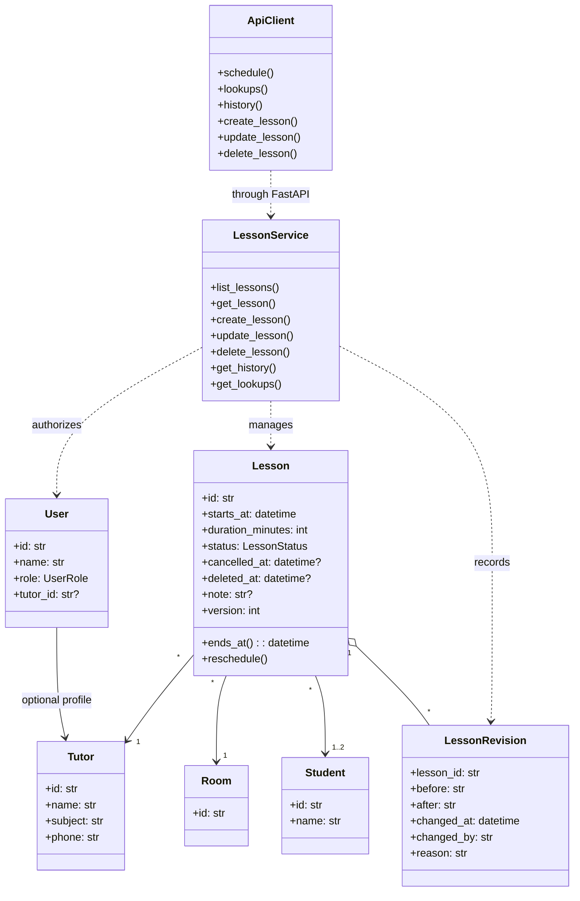
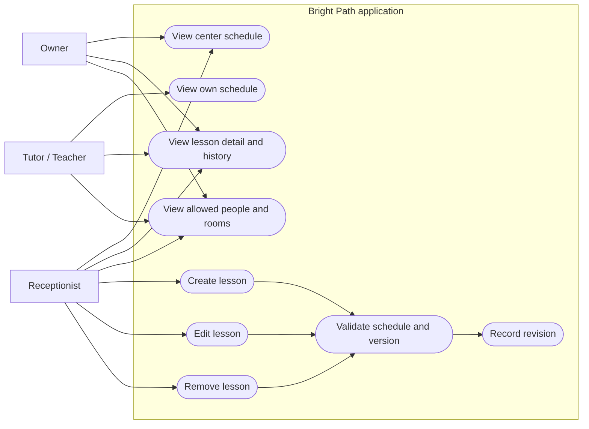

<!-- DESIGN-DIRECTOR:START -->
# Design Director System

## Context
- Product: Bright Path tutoring-center scheduling and daily operations
- Audience: owners, receptionists, managers, and tutors
- Primary job: inspect current lesson data and let receptionists create, edit, or remove lessons safely
- Surface: internal web application
- Platform and stack: Streamlit UI backed by FastAPI
- Page or flow: schedule list, lesson detail, reference directories, and lesson CRUD forms

## Direction
- Functional grammar: operations-console
- Primary style: Trust and Authority
- Primary profile: enterprise
- Profile contract: `C:/Users/Admin/.codex/skills/design-director/profiles/enterprise/DESIGN.md`
- Supporting influence: none
- Accent profile: none
- Blend ratio: none
- Axis ownership: Enterprise owns all design axes
- Borrowed traits: none
- Protected traits: stable navigation, dense evidence, permission-aware workflows, and accessible interaction
- Blend conflicts: none
- Density: compact but not crowded, 2/5
- Theme: light neutral foundation
- Signature move: show the complete current schedule with role-appropriate actions beside the data

## Foundations
- Semantic colors: blue for primary action, green for success, amber for changed data, red for destructive actions and errors, neutral colors for normal state
- Typography: Streamlit system sans with a disciplined heading scale
- Spacing: consistent medium spacing with compact schedule rows
- Radius: Streamlit defaults; do not create competing radius systems
- Elevation: minimal and only when hierarchy requires it
- Icons: familiar labeled icons only when they improve scanning
- Imagery: none; use real schedule evidence
- Motion: immediate state feedback only, with no decorative animation

## Components and behavior
- Navigation: stable sidebar with role-appropriate destinations
- Primary content: chronological schedules, complete lesson data, revision history, and actionable errors
- Actions: one clear primary action per form
- Required states: default, loading, empty, error, success, stale, and permission denied
- Responsive behavior: stack controls and preserve reading order at narrow widths
- Platform behavior: use native Streamlit controls and keep keyboard completion possible

## Do
- Pair every status color with visible text.
- Preserve entered form values after recoverable errors.
- Keep owner and tutor views read-only.

## Avoid
- Do not create decorative dashboards, rainbow schedules, hidden hover-only information, or custom motion.
- Do not claim that a tutor read a change merely because it is visible.

## Quality gate
- Minimum score: 80/100
- Hard gates: WCAG AA, visible focus, keyboard/touch completion, required dynamic states, reduced motion, clean render
<!-- DESIGN-DIRECTOR:END -->

## Core domain model

SQLite stores the operational records and immutable raw import evidence. Internal student IDs are deterministic hashes derived from the exact source name; they are implementation identifiers, not claimed source fields. Only the three observed room IDs are seeded.

## Use cases

## Implemented interface review

- Enterprise operations direction: implemented with stable sidebar navigation, dense schedule evidence, and one primary action per form.
- Responsive behavior: native controls keep a single reading order; metric blocks wrap and schedule tables scroll inside their container at narrow widths.
- Accessibility: native labels, visible text for every status, keyboard-operable controls, visible focus behavior, and no decorative animation.
- Dynamic states: empty, validation error, stale edit, permission failure, success, history, and confirmation states are represented.
- Design quality score: **91/100** against the selected Enterprise profile; all hard gates passed in the rendered desktop/narrow review.
