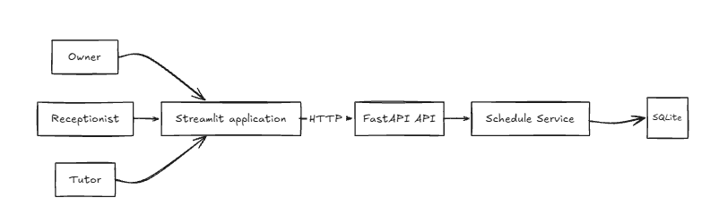
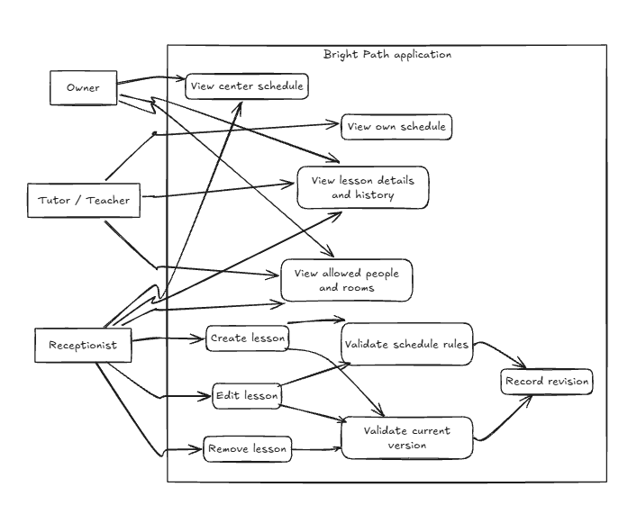
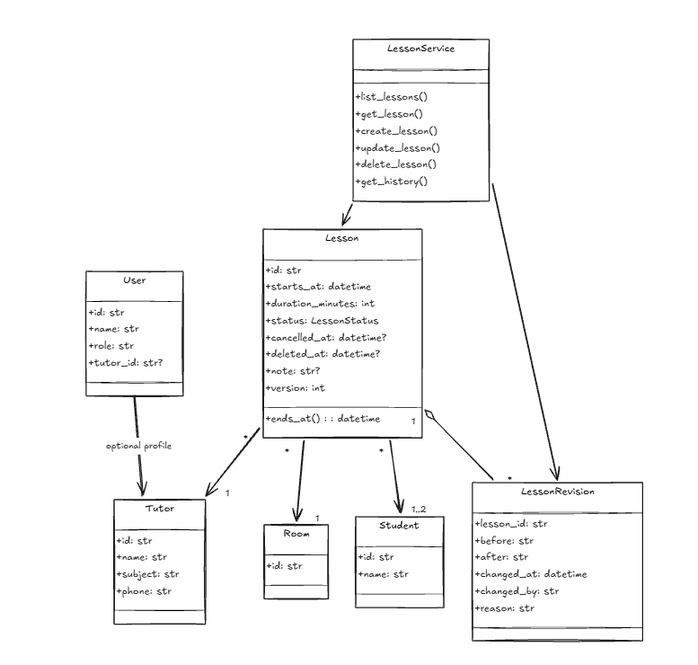

# Bright Path Scheduling

Bright Path Scheduling is an internal scheduling and daily-operations application for a tutoring center. It replaces disconnected spreadsheet views with one shared schedule that owners and tutors can inspect while receptionists safely maintain lesson data.

The application is built for **shared change monitoring and synchronized operational data**:

- receptionists create, edit, cancel, or remove lessons through one controlled workflow;
- owners view the current center schedule and its revision history;
- tutors view only their assigned lessons and can identify lessons that changed;
- all roles read from the same FastAPI service and SQLite source of truth; and
- imported spreadsheet rows remain preserved as evidence instead of being silently repaired.

> **Current MVP meaning of “real-time”:** after a receptionist commits a change, the shared database and API immediately contain the new version. Other users see that committed version on their next page refresh or Streamlit rerun. This release does not use WebSockets, push notifications, or tutor read acknowledgements.

## Main capabilities

| Capability | Owner | Receptionist | Tutor |
| --- | --- | --- | --- |
| View the complete center schedule | Yes | Yes | No |
| View an assigned personal schedule | N/A | N/A | Yes |
| View permitted lesson details and history | Yes | Yes | Yes |
| View permitted tutors, students, and rooms | Yes | Yes | Yes |
| Create, edit, cancel, or remove lessons | No | Yes | No |

Lesson removal is a soft deletion: the lesson disappears from current schedules while its record and revision history remain available for auditing.

## Clone and run on Windows

### Prerequisites

- Git
- Windows PowerShell
- [`uv`](https://docs.astral.sh/uv/)

### 1. Clone the repository

```powershell
git clone https://github.com/essor1234/Synergie_Test.git
Set-Location -LiteralPath '.\Synergie_Test'
```

### 2. Set up and verify the project

```powershell
.\init.ps1 -Action Setup
.\init.ps1 -Action Verify
```

`Verify` runs Ruff and the complete automated test suite.

### 3. Start the application

```powershell
.\init.ps1 -Action Start
```

The start command validates and applies the source seed idempotently, launches both services, and remains attached while they run. The terminal displays:

```text
Bright Path is running.
Application:       http://127.0.0.1:8501
API documentation: http://127.0.0.1:8000/docs
Press Ctrl+C to stop Bright Path.
```

Open `http://127.0.0.1:8501` in a browser. Keep the terminal open and press Ctrl+C to stop the API and UI cleanly.

From a second terminal, the harness can be inspected or stopped with:

```powershell
.\init.ps1 -Action Status
.\init.ps1 -Action Stop
```

For database reset, port recovery, process safety, and handoff instructions, see [RUNBOOK.md](RUNBOOK.md).

## Change monitoring and data synchronization

The application keeps schedule changes visible and prevents one user's stale screen from silently replacing a newer update.

1. The receptionist submits a lesson mutation through Streamlit.
2. Streamlit sends the request to FastAPI with the lesson's expected version.
3. `LessonService` checks role permissions, the current version, and scheduling safeguards.
4. SQLite saves the lesson and its before/after revision in one transaction.
5. Owner and tutor views retrieve the latest permitted version from the same API.
6. Revised lessons are marked as changed, and their reason and history remain inspectable.

If another user already changed the lesson, the stale update is rejected with HTTP `409`. The receptionist must refresh and retry from the current version.

Spreadsheet synchronization is deliberately one-way in this MVP. The supplied CSV files are validated and imported idempotently into SQLite; application edits are not written back to the spreadsheets.

## System design

### Architecture



Owner, Receptionist, and Tutor users interact with a responsive Streamlit interface. Streamlit communicates over HTTP with FastAPI, which delegates lesson workflows to the service layer before reading or writing SQLite. The original sketch labels this layer “Schedule Service”; the implemented class is `LessonService`.

The architecture keeps responsibilities small:

- **Streamlit UI:** role-aware pages, filters, lesson forms, errors, and change indicators.
- **FastAPI:** HTTP validation, demo actor headers, permissions, and consistent responses.
- **LessonService:** lesson queries, transactional CRUD, version checks, scheduling safeguards, and revision creation.
- **Domain models:** `User`, `Tutor`, `Student`, `Room`, `Lesson`, and `LessonRevision`.
- **SQLite:** operational records, immutable import evidence, participants, and revision history.

### Use cases and roles



Owners have read-only center oversight. Tutors have read-only access to their own schedules and related data. Receptionists can maintain lessons; every mutation is validated, version checked, and recorded as a revision.

### Class design



The code uses lightweight object-oriented design. Domain classes represent scheduling concepts, while `LessonService` coordinates application behavior. There is no ORM, repository-interface layer, unit-of-work abstraction, or dependency-injection framework because the assessment workflow does not require them.

## Project structure

```text
Synergie_Test/
├── data/
│   ├── source/                 # supplied CSV evidence and explicit resolutions
│   └── runtime/                # ignored SQLite database
├── scripts/                    # seed, verification, and service harness scripts
├── src/bright_path/
│   ├── domain/models.py        # domain objects
│   ├── services/lesson_service.py
│   ├── storage/                # SQLite schema and source importer
│   ├── api/                    # FastAPI routes and schemas
│   ├── ui/                     # Streamlit pages and API client
│   └── settings.py
├── tests/
├── init.ps1
├── RUNBOOK.md
└── DESIGN.md
```

## Demo workflow

1. Select **Owner** and inspect the center schedule, lesson details, and revision history.
2. Select **Receptionist**, open **Manage lessons**, and use the Create, Edit, or Remove tab. Every mutation requires a reason.
3. Edit `L034`, moving it from 09:00 to 10:00 on 10 March 2026. The valid back-to-back slot is accepted, the version increments, and a revision is recorded.
4. Select **Tutor**, choose **Ngoc Anh**, and inspect **My schedule**. Only that tutor's lessons are visible, and the revised lesson is marked as changed.

The role selector is a demonstration mechanism, not production authentication. A change being visible does not mean the tutor has read or acknowledged it.

## Scheduling safeguards

Receptionist writes are rejected when they:

- overlap an active tutor, room, or student booking;
- give a tutor more than six active lessons in one day;
- schedule a lesson on Monday;
- use a duration other than 60 or 90 minutes;
- contain fewer than one or more than two students;
- use unknown references or inconsistent cancellation data; or
- submit an out-of-date `expected_version`.

Cancelled lessons free their time and room. No-shows continue to occupy them. Back-to-back lessons are allowed. Historical source violations remain preserved; safeguards apply to new or changed operational data rather than silently rewriting history.

## Spreadsheet seed and source preservation

Preview the import without opening or changing SQLite:

```powershell
.\.venv\Scripts\python.exe scripts\seed_database.py --mode preview
```

Apply the validated import manually:

```powershell
.\.venv\Scripts\python.exe scripts\seed_database.py --mode apply
```

The importer preserves 34 immutable raw lesson rows and creates 33 operational lessons with 34 participant relationships. `L009` and `L010` remain separate evidence rows but map to the paired operational lesson `L009` through `data/source/group_resolutions.json`. Reapplying identical input is a no-op. Only the observed room identifiers `R1`–`R3` are imported.

The fixed demonstration timestamp defaults to `2026-03-10T08:00:00+07:00`, inside the source dataset period, and can be changed with `BRIGHT_PATH_DEMO_NOW`.

## API

Demo requests require `X-Demo-Role: owner`, `receptionist`, or `tutor`. Tutor requests also require `X-Demo-Tutor-Id`.

| Method | Path | Purpose |
| --- | --- | --- |
| `GET` | `/health` | Service health |
| `GET` | `/api/v1/schedule` | Role-filtered current schedule |
| `GET` | `/api/v1/tutors/{tutor_id}/schedule` | Permitted tutor schedule |
| `GET` | `/api/v1/lookups` | Role-filtered tutors, students, and rooms |
| `GET` | `/api/v1/lessons/{lesson_id}` | Lesson detail |
| `POST` | `/api/v1/lessons` | Receptionist creates a lesson |
| `PATCH` | `/api/v1/lessons/{lesson_id}` | Receptionist updates editable lesson fields |
| `DELETE` | `/api/v1/lessons/{lesson_id}` | Receptionist soft-deletes a lesson |
| `GET` | `/api/v1/lessons/{lesson_id}/history` | Revision history |

Unsafe or stale writes return `409` with a specific explanation. There is intentionally no bulk schedule-replacement endpoint because bulk overwrite would make per-lesson permissions, version checks, and revision evidence ambiguous.

## Verification

```powershell
.\init.ps1 -Action Verify
```

The suite covers source preservation, CSV schema coverage, repeat imports, role privacy, scheduling safeguards, transaction rollback, API responses, stale writes, response formatting, and role-specific Streamlit navigation.

## Current limitations and deferred work

The MVP demonstrates a complete spreadsheet-to-application workflow with synchronized shared data, transactional changes, and visible history. Native Streamlit controls make the internal application responsive and quick to operate, but this is not yet a production deployment.

Deferred work includes production authentication, WebSocket or push delivery, tutor read acknowledgement, lesson recovery UI, participant-level cancellation, billing and tutor payment, messaging integration, two-way spreadsheet synchronization, PostgreSQL migrations, and broader analytics.
